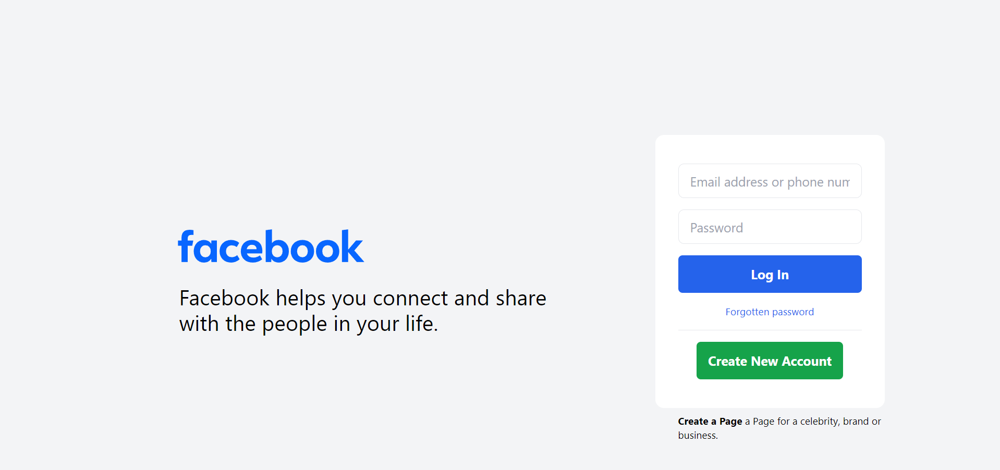

# Facebook Login Page

📝 This is a simple HTML page mimicking the Facebook login interface.

## Description
ℹ️ This page allows users to log in to their Facebook accounts or create new ones.

## Preview
👀 Below is a preview of the login page:

## Usage
## Usage
🚀 To use this page:
1. Clone the repository.
2. Install the necessary dependencies by running `npm install` in your terminal to add node modules.
3. Open the `index.html` file in a web browser.
4. Enter your email/phone and password to log in or click "Create New Account" to register.

## Features
✨ This page includes:
- Input fields for email/phone and password.
- "Log In" button.
- "Forgotten password" link.
- "Create New Account" button.
- "Create a Page" link for celebrities, brands, or businesses.

## Technologies Used
🛠️ This project uses TailwindCSS.

## Contributing
🤝 Contributions are welcome! Feel free to open an issue or submit a pull request.

